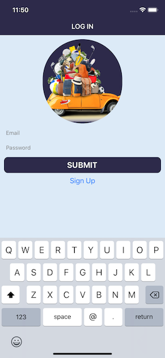
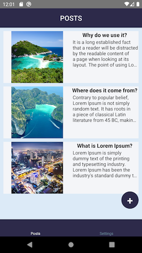
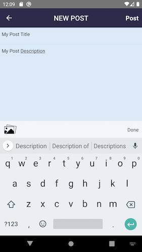
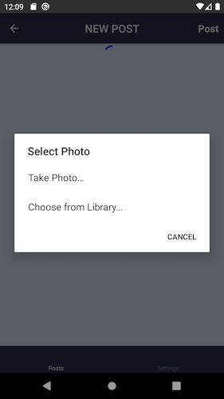
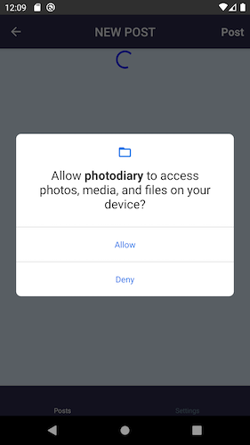
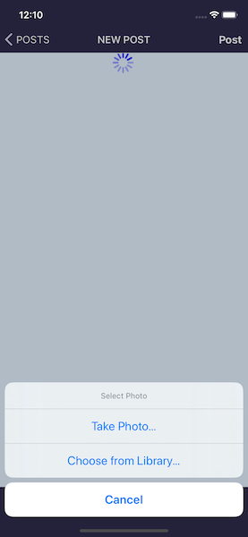
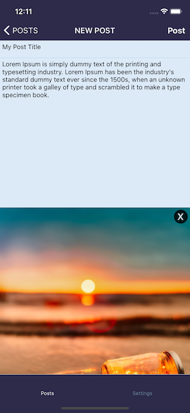

# Photodiary - iOS/Android

Purpose of this project:

- Explore RNFirebase
- Explore the new react navigation V5 including hooks and implementing unit tests for it
- Explore enzyme vs react-native-testing-library vs @testing-library/react-native
- Explore react-native-image-picker from the react native community (created a customHook for it)
- Explore redux hooks useDispatch and useSelector
- Setup Hermes engine for Android
- Use Flipper for debugging
- During the project I also took on board the challenge to implement InputAccessoryView for Android

**LoginScreen**

Simple login form with two TextInputs. It interacts with RNF to verify that a user exists.
Thoughts: This is the simplest and most basic way to use RNF. I think it works really well for this simple operations. I found that the most important part is to setup solid rules for the DB to ensure that only authenticated users can access their data

There is a base InputField component that accepts props from styles to a customHook “useInput”
Thoughts: Nothing really unusual on this it was like creating a base InputField from the <input /> tag in React Web. Nice to implement a custom hooks for value and onChangeText.

This login form is also reused for the signup screen. It renders two additional fields based on the route name extracted with the hook useRoute.
Thoughts: In an official project I would definitely create separate forms. After all the logic for the two forms may change and it would make it harder to manage and test but it was useful to test the **useRoute** hook from the react navigation.

```
...
const { name } = useRoute();
const isSignUpScreen = name === 'SignUpScreen';
...

return (
    <ScrollView>
      <KeyboardAvoidingView
        behavior="position"
        enabled
        keyboardVerticalOffset={70}>
        <Logo />

        {isSignUpScreen && (
          <InputField
            accessibilityLabel="username"
            placeHolder="Username"
            inputValue={displayName}
            onSubmitEditing={handleSubmit}
          />
        )}

        <InputField
          accessibilityLabel="email"
          placeHolder="Email"
          inputValue={email}
          onSubmitEditing={handleSubmit}
          keyboardType={'email-address'}
        />
        <InputField
          accessibilityLabel="password"
          placeHolder="Password"
          inputValue={password}
          onSubmitEditing={handleSubmit}
          secureTextEntry
        />
        ...
```



**PostsScreen**

This has a very basic usage of the FlatList. I create a button to navigate to the PostAddScreen which uses an absolute position (Twitter like).
Thoughts: I played a lot with the useEffect in here and with useIsFocused and useNavigation hooks from react navigation. These hooks helped to trigger different redux actions based on the redux state also extracted using useSelector hook from redux

```
...
const { email } = useSelector((state) => state.user.userDetails);
  const { allPosts } = useSelector((state) => state.posts);
  const { isFetching } = useSelector((state) => state.posts);
  const { createPostSuccess } = useSelector((state) => state.posts);
  const { deletePostSuccess } = useSelector((state) => state.posts);
  const { updatePostSuccess } = useSelector((state) => state.posts);

  const dispatch = useDispatch();
  const navigation = useNavigation();
  const isFocused = useIsFocused();

  useEffect(() => {
    if (email) {
      dispatch(getAllPosts());
      console.log('USEEFFECT ONE');
    }
  }, [dispatch, email]);

  useEffect(() => {
    if (isFocused && createPostSuccess) {
      console.log('USEEFFECT IF ONE');
      dispatch(clearPostsSuccess(0));
      dispatch(getAllPosts());
    }

    if (updatePostSuccess) {
      console.log('USEEFFECT IF TWO');
      dispatch(clearUpdatePostSuccess(0));
      dispatch(getAllPosts());
    }

    if (isFocused && deletePostSuccess) {
      console.log('USEEFFECT IF THREE');
      dispatch(clearDeletePostSuccess(0));
      dispatch(getAllPosts());
    }
  }, [
    isFocused,
    createPostSuccess,
    deletePostSuccess,
    updatePostSuccess,
    dispatch,
  ]);
  ...
```



**PostAddScreen**
Here to explore the image picker from the RNCommunity. To select an image I created a custom hook "useImagePicker"

```
export const useImagePicker = () => {
  const dispatch = useDispatch();
  const [imageUriDevice, setImageUri] = useState();

  const options = {
    title: 'Select Photo',
    storageOptions: {
      skipBackup: true,
      path: 'images',
    },
    permissionDenied: {
      title: 'Camera Access',
      text: 'Need permission to access the camera',
    },
  };

  const handleChoosePhoto = () => {
    dispatch(selectImageFromDeviceRequest(true));
    ImagePicker.showImagePicker(options, (response) => {
      if (response.didCancel) {
        dispatch(selectImageFromDeviceFailure('Select image cancelled'));
      } else if (response.error) {
        dispatch(selectImageFromDeviceFailure(response.error));
      } else {
        dispatch(imageFromDeviceSuccess('success'));
        if (response) {
          const photoPath =
            Platform.OS === 'ios' ? response.uri : `file://${response.path}`;
          setImageUri(photoPath);
        }
      }
      dispatch(selectImageFromDeviceRequest(false));
    });
  };

  const handleDeletePhoto = () => {
    setImageUri();
  };

  return [imageUriDevice, handleChoosePhoto, handleDeletePhoto];
};
```

Few screens from iOS and Android






