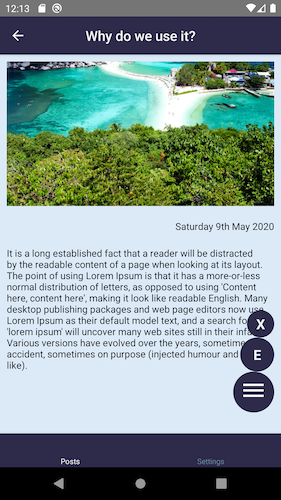
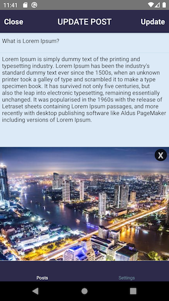
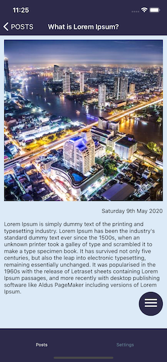
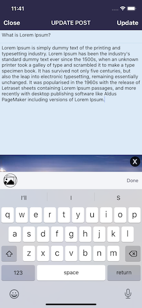

# Photodiary - iOS/Android

Purpose of this project:

- Explore RNFirebase
- Explore the new react navigation V5 including hooks and implementing unit tests for it
- Explore enzyme vs react-native-testing-library vs @testing-library/react-native
- Explore react-native-image-picker from the react native community (created a customHook for it)
- Explore redux hooks useDispatch and useSelector
- Setup Hermes engine for Android
- Use Flipper for debugging
- During the project I also took on board the challenge to implement InputAccessoryView for Android

## LoginScreen

Simple login form with two TextInputs. It interacts with RNF to verify that a user exists.

**Thoughts**: This is the simplest and most basic way to use RNF. I think it works really well for this simple apps. I found that the most important part is to setup
solid
rules for the DB to ensure that only authenticated users can access their data

There is a base InputField component that accepts props, from styles to a customHook **useInput** and secureTextEntry prop.

```
const InputField = ({
  style,
  placeHolder,
  inputValue,
  onSubmitEditing,
  ...rest
}) => {
  return (
    <TextInput
      style={[inputFieldStyles.textInput, style]}
      placeholder={placeHolder}
      placeholderTextColor="grey"
      onSubmitEditing={onSubmitEditing}
      {...inputValue}
      {...rest}
    />
  );
};
```

```
export const useInput = (initialValue = '') => {
  const [value, setValue] = useState(initialValue);
  return {
    value,
    onChangeText: (text) => setValue(text),
  };
};
```

**Thoughts**: Nothing really unusual on this it was like creating a base InputField from the <input /> tag in React Web. Nice to implement a custom hooks for the field
**value** and **onChangeText**.

This login form is also reused for the signup screen. It renders two additional fields based on the route name extracted with the hook useRoute.

```
...
const { name } = useRoute();
const isSignUpScreen = name === 'SignUpScreen';
...
const email = useInput('');
const password = useInput('');
...
return (
    <ScrollView>
      <KeyboardAvoidingView
        behavior="position"
        enabled
        keyboardVerticalOffset={70}>
        <Logo />

        {isSignUpScreen && (
          <InputField
            accessibilityLabel="username"
            placeHolder="Username"
            inputValue={displayName}
            onSubmitEditing={handleSubmit}
          />
        )}

        <InputField
          accessibilityLabel="email"
          placeHolder="Email"
          inputValue={email}
          onSubmitEditing={handleSubmit}
          keyboardType={'email-address'}
        />
        <InputField
          accessibilityLabel="password"
          placeHolder="Password"
          inputValue={password}
          onSubmitEditing={handleSubmit}
          secureTextEntry
        />
        ...
```

**Thoughts**: In an official project I would definitely create separate forms. After all the logic for the two forms may change and it would make it harder to manage and
test but it was useful to test the **useRoute** hook from the react navigation.


## PostsScreen

This has a very basic usage of the FlatList. I create a button to navigate to the PostAddScreen which uses an absolute position (Twitter like).
I used this screen to play with the useEffect hook when navigating back and forth from the screen. E.g. navigating back after creating a new post or
updating and deleting a post.

```
  ...
  const { email } = useSelector((state) => state.user.userDetails);
  const { allPosts } = useSelector((state) => state.posts);
  const { isFetching } = useSelector((state) => state.posts);
  const { createPostSuccess } = useSelector((state) => state.posts);
  const { deletePostSuccess } = useSelector((state) => state.posts);
  const { updatePostSuccess } = useSelector((state) => state.posts);

  const dispatch = useDispatch();
  const navigation = useNavigation();
  const isFocused = useIsFocused();

  useEffect(() => {
    if (email) {
      dispatch(getAllPosts());
      console.log('USEEFFECT ONE');
    }
  }, [dispatch, email]);

  useEffect(() => {
    if (isFocused && createPostSuccess) {
      console.log('USEEFFECT IF ONE');
      dispatch(clearPostsSuccess(0));
      dispatch(getAllPosts());
    }

    if (updatePostSuccess) {
      console.log('USEEFFECT IF TWO');
      dispatch(clearUpdatePostSuccess(0));
      dispatch(getAllPosts());
    }

    if (isFocused && deletePostSuccess) {
      console.log('USEEFFECT IF THREE');
      dispatch(clearDeletePostSuccess(0));
      dispatch(getAllPosts());
    }
  }, [
    isFocused,
    createPostSuccess,
    deletePostSuccess,
    updatePostSuccess,
    dispatch,
  ]);
  ...
```

**Thoughts**: I played a lot with the useEffect in here and with **useIsFocused** and **useNavigation** hooks from react navigation. These hooks helped to trigger
different
redux actions based on the redux state also extracted using **useSelector** hook from redux


## PostAddScreen

Here to explore the image picker from the RNCommunity. To select an image I created a custom hook **useImagePicker**.

```
export const useImagePicker = () => {
  const dispatch = useDispatch();
  const [imageUriDevice, setImageUri] = useState();

  const options = {
    title: 'Select Photo',
    storageOptions: {
      skipBackup: true,
      path: 'images',
    },
    permissionDenied: {
      title: 'Camera Access',
      text: 'Need permission to access the camera',
    },
  };

  const handleChoosePhoto = () => {
    dispatch(selectImageFromDeviceRequest(true));
    ImagePicker.showImagePicker(options, (response) => {
      if (response.didCancel) {
        dispatch(selectImageFromDeviceFailure('Select image cancelled'));
      } else if (response.error) {
        dispatch(selectImageFromDeviceFailure(response.error));
      } else {
        dispatch(imageFromDeviceSuccess('success'));
        if (response) {
          const photoPath =
            Platform.OS === 'ios' ? response.uri : `file://${response.path}`;
          setImageUri(photoPath);
        }
      }
      dispatch(selectImageFromDeviceRequest(false));
    });
  };

  const handleDeletePhoto = () => {
    setImageUri();
  };

  return [imageUriDevice, handleChoosePhoto, handleDeletePhoto];
};
```

Also set the challenge of creating a keyboard toolbox for Android (InputAccessoryView for iOS).
To position the KTB on top of the android keyboard I implemented two event listeners **keyboardDidShow** and **keyboardDidHide** in an useEffect hook

```
useEffect(() => {
    let keyboardDidShowListener;
    let keyboardDidHideListener;

    keyboardDidShowListener = Keyboard.addListener(
      'keyboardDidShow',
      keyboardDidShow,
    );
    keyboardDidHideListener = Keyboard.addListener(
      'keyboardDidHide',
      keyboardDidShow,
    );

    return () => {
      if (keyboardDidShowListener) {
        keyboardDidShowListener.remove();
      }
      if (keyboardDidHideListener) {
        keyboardDidHideListener.remove();
      }
    };
  });
```

and fired a function to grab the keyboard height minus the height of the View creating the toolbox

```
const keyboardDidShow = (e) => {
    setToolbarPosition(e.endCoordinates.height - 50);
    setIsKeyboardOpen(!isKeyboardOpen);
  };
```

Few screens from iOS and Android


## PostDetailsScreen

This screen shows details of the post and a menu with position absolute which opens showing a **X** to delete and an **E** to navigate to the edit screen.
Nothing overly completed but I used this screen also to play around with hooks when navigating back and forth.

```
useEffect(() => {
    if (isFocused) {
      dispatch(
        getPostDetails(
          allPosts.find((post) => post.postId === route.params.postId),
        ),
      );
    }
    // eslint-disable-next-line react-hooks/exhaustive-deps
  }, [isFocused]);

  useEffect(() => {
    if (deletePostSuccess) {
      navigation.goBack();
    }

    return () => {
      dispatch(clearPostsDetails({}));
    };
  }, [deletePostSuccess, dispatch, navigation]);

  const handleDeletePost = () => {
    const { postId } = postDetails;
    alertFactory('Delete Post', 'Are you sure you want to delete this post?', [
      {
        text: 'Cancel',
      },
      {
        text: 'Delete',
        onPress: () => dispatch(deletePost(postId, postDetails.imageId)),
      },
    ]);
  };

  const handleEditPost = () => {
    navigation.navigate('UpdatePostDetailsScreen');
    dispatch(isEditingPost(true));
  };
```

Few screens from iOS and Android








## Testing Libraries

I work on a daily basis with jest & enzyme, so the most natural solution was to implement tests with both. As for the enzyme documentation there some limitation for RN
therefore I looked into other solutions. I explored the react testing library for the web from Kent C. Dodds and found out that there is an implementation for RN and
based on the same principles [@testing-library/react-native](https://www.native-testing-library.com/). I also found [react-native-testing-library](https://callstack
.com/) from callstack.com
